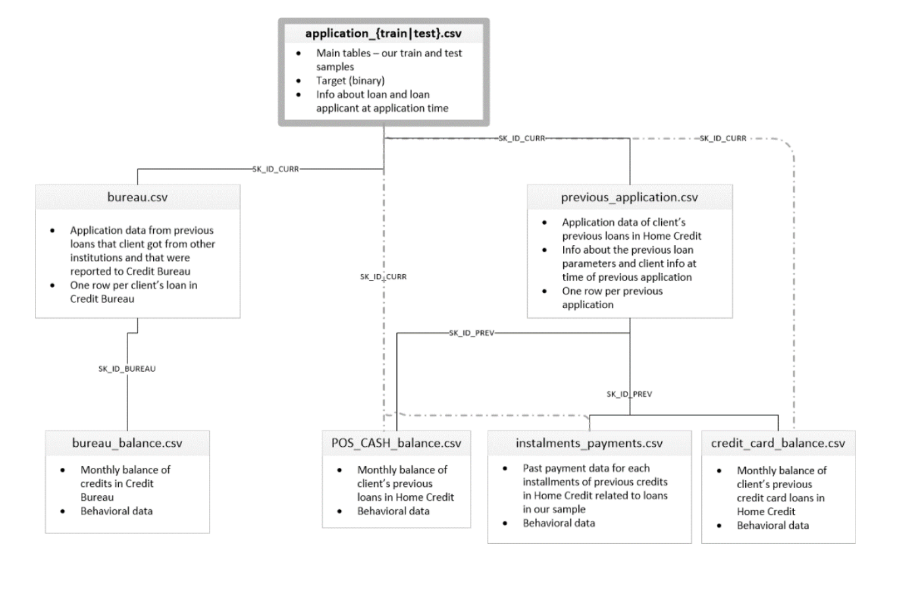
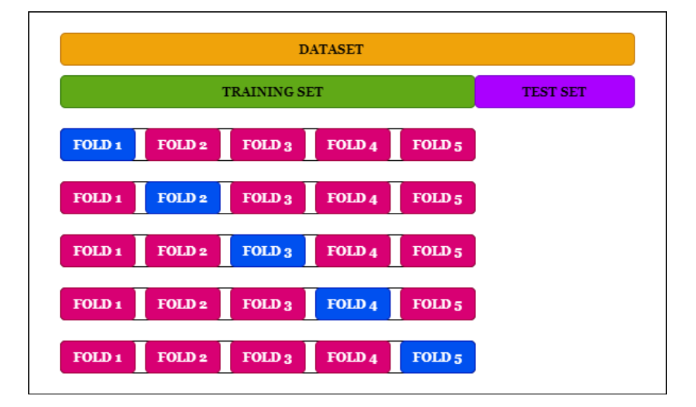
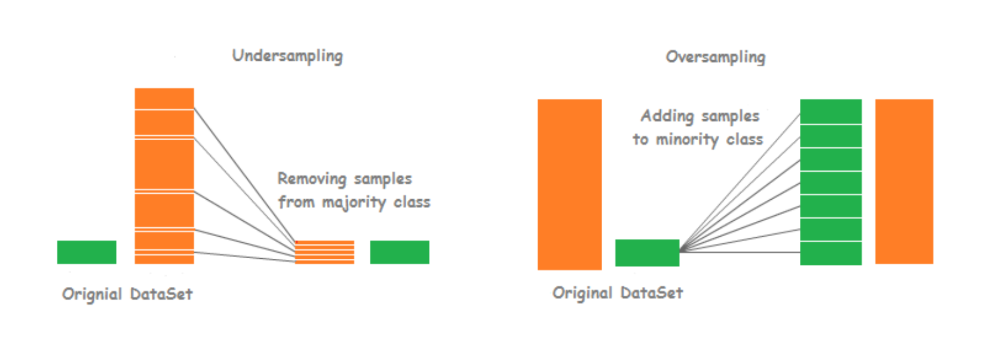
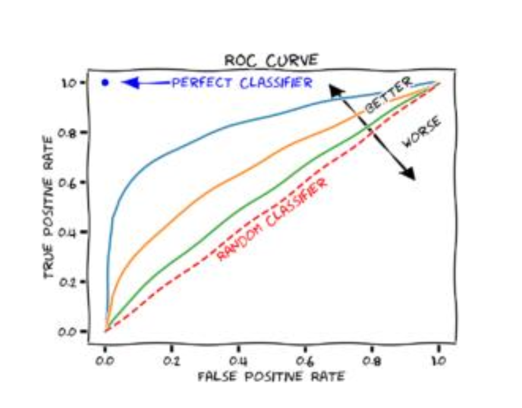
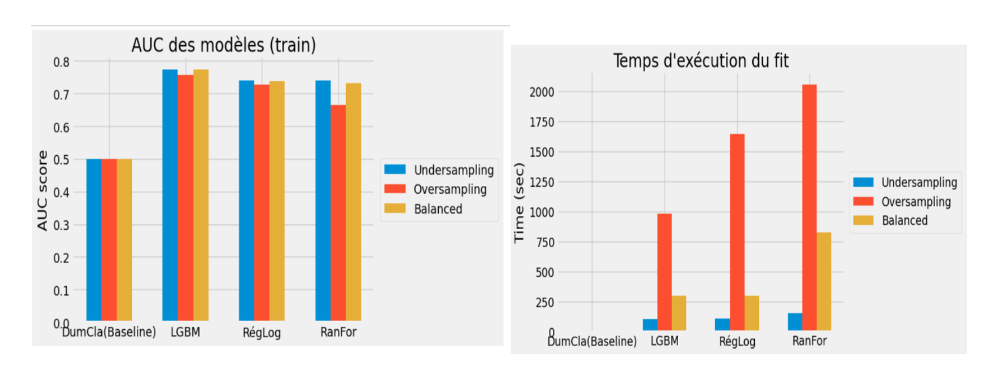
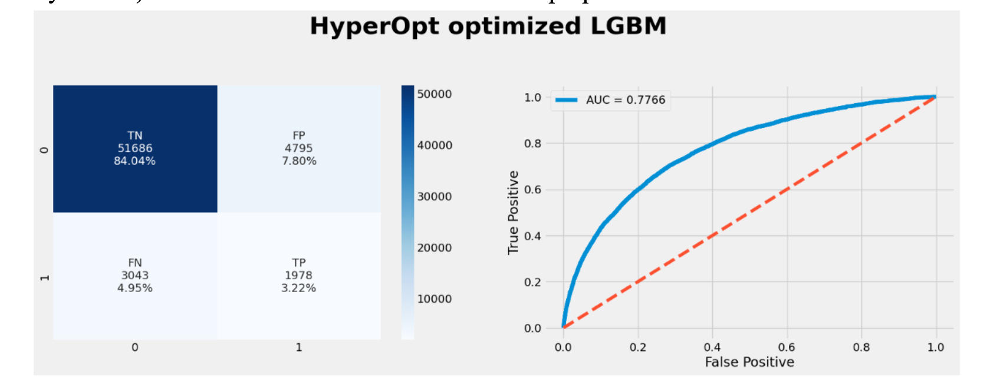
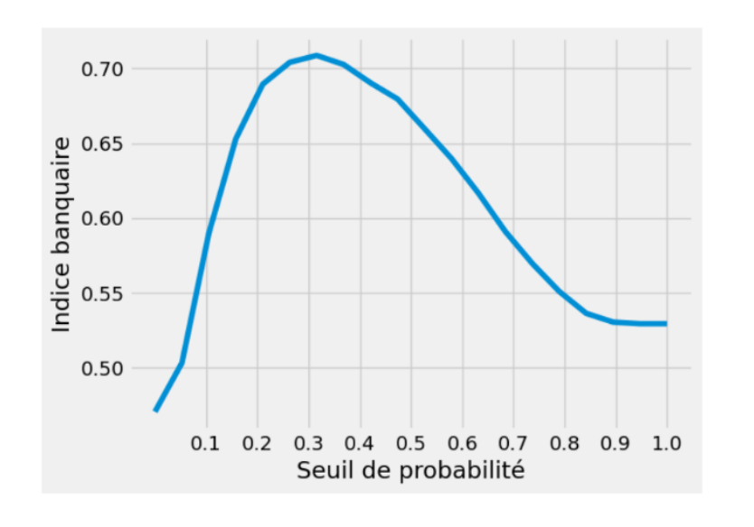
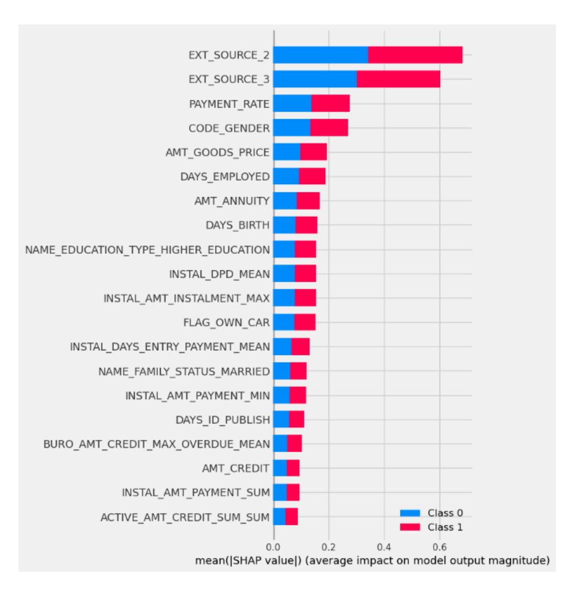

# Implémentez un modèle de scoring
## Projet7-Openclassrooms

&nbsp;
**Author:** Gulsum Kapanoglu
***

## Description de projet!

Le projet consiste à développer pour la société « Prêt à Dépenser », une société de crédit de consommation, un modèle de scoring de la probabilité de défaut de paiement d’un client avec pas ou peu d’historique de prêt. Il s’agit donc d’un problème de classification binaire supervisée dans lequel la variable cible (TARGET) à prédire vaudra 0 si le client est solvable et 1 s’il ne l’est pas.

Les données utilisées pour ce projet sont une base de données de 307 000 clients comportant 121 features (âge, sexe, emploi, logement, revenus, informations relatives au crédit, notation externe, etc.)

## Méthodologie

Le modèle entraîné dans le cadre de ce projet a été entraîné sur la base du jeu de données après analyse exploratoire et création de nouvelles features. Le notebook utilisé est consultable sur le site Kaggle.
Le jeu de données initial a été séparé en plusieurs parties de façon à disposer :

• D’un jeu de training (75% des individus) qui a été séparé en plusieurs folds pour entraîner les différents modèles et optimiser les paramètres (cross validation) sans overfitting.
• D’un jeu de test (25 % des individus) pour l’évaluation finale du modèle

La variable cible à prédire prend 2 valeurs et est fortement déséquilibrée (8/92) :
0 – positive – non défaillant : indique que le client a totalement remboursé son prêt
1 – négative – défaillant : indique que le client n’a pas remboursé son prêt en totalité ou en partie.

Dans un premier time, On a un problème de classification binaire avec une classe sous représentée (8 % de clients qui ne remboursent pas encodé par la valeur 1, contre 91 % de clients qui remboursent encodé par la valeur 0). Ce déséquilibre des classes doit être pris en compte dans l’entraînement des modèles.

Pour gérer ce déséquilibre, il y a 3 approches :

• Undersampling (RandomUnderSampler de la librairie Imbalanced-Learn) : suppression des observations de la classe majoritaire afin de rééquilibrer le jeu de données.
• Oversampling (SMOTE de la librairie Imbalanced-Learn) : répétition des observations de la classe minoritaire afin de rééquilibrer le jeu de données.
• Class_weight="balanced" : argument qui indique le déséquilibre à l’algorithme afin qu'il en tienne compte directement.

Afin de modéliser au mieux le problème, les performances les algorithmes comparés sont :

✓ DummyClassifier (Baseline)
✓ Light Gradient Boosting Machine
✓ Régression Logistique ✓ RandomForestClassifier

## Afin d’évaluation ;
La métrique utilisée pour évaluer les performances de chacun des modèles est l’AUC (Area Under the ROC Curve). Plus l'AUC est élevée, plus le modèle est capable de prédire des bons résultats.

Le meilleur modèle a été sélectionné sur la base du score AUC moyen obtenu dans sur l’ensemble des splits la validation croisée (GridSearchCv). Le score AUC obtenu dans l'ensemble de test a également été calculé. L'algorithme LGBM donne les meilleurs résultats lorsqu'il est combiné avec une stratégie de rééquilibrage où " Undersampling " est spécifié comme sampling méthode donne les meilleurs résultats.

- Chacun des modèles entrainés a été optimisé en testant plusieurs valeurs des 2 ou 3 principaux hyperparamètres (car l’exécution de GridSearch prend beaucoup de temps). Elargir le nombre d’hyperparamètres pourrait peut-être permettre une amélioration des performances des différents modèles.

## Algorithme d’optimisation

Une fois le modèle choisi (LGBM) et ses hyperparamètres optimisés d’un point de vue technique (via l’AUC avec GridSearch), nous avons à nouveau effectué une nouvelle recherche des hyperparamètres via HyperOpt (algorithme qui utilise l’optimisation bayésienne) en se basant sur la fonction coût métier proposée.

De cette façon, les hyperparamètres optimaux du modèle sont choisis de sorte à minimiser la perte pour l'entreprise. HyperOpt nécessite 4 paramètres pour une implémentation de base à savoir : la fonction objectif (à minimiser loss = 1-score), l'espace de recherche (plages pour les hyperparamètres), l'algorithme d'optimisation et le nombre d'itérations.

Le seuil de solvabilité optimum, en fonction de notre métrique bancaire, est de 0.32.

## Interprétabilité
Le modèle étant destiné à des équipes opérationnelles devant être en mesure d’expliquer les décisions de l’algorithme à des clients réels, le modèle est accompagné d’un module d’explicabilité.
Il est donc nécessaire à la fois, de connaître d'une manière générale les principales features qui contribuent à l'élaboration du modèle, et de manière spécifique pour le client qu'elle est l'influence de chaque feature dans le calcul de son propre score (feature importance locale).

Pour cela nous avons utilisé une librairie spécialisée de type Shap afin de fournir un calcul de la feature importance globale indépendante de l'algorithme (car en effet, de nombreux algorithmes proposent des fonctionnalités de feature importance globale, mais spécifiques à l'algorithme).

## Amélioration Du Modelé
✓ Chacun des modèles entrainés a été optimisé en testant plusieurs valeurs des 2 ou 3 principaux hyperparamètres (car l’exécution de GridSearch prend beaucoup de temps). Elargir le nombre d’hyperparamètres pourrait peut-être permettre une amélioration des performances des différents modèles.

✓ Pour aller plus loin, la partie prétraitement du jeu de données a été abordée superficiellement en réutilisant un kernel de Kaggle basé uniquement sur une table du jeu de données. Il y aura probablement une opportunité d'améliorer la modélisation en créant de nouvelles fonctionnalités en collaboration avec les équipes commerciales ainsi qu'en utilisant d'autres fonctionnalités des données fournies.

Ce travail a été réalisé lors du projet 7 de ma formation Centrale Supèlec et OpenClassrooms de Data Scientist durant le mois de Novembre 2022.
